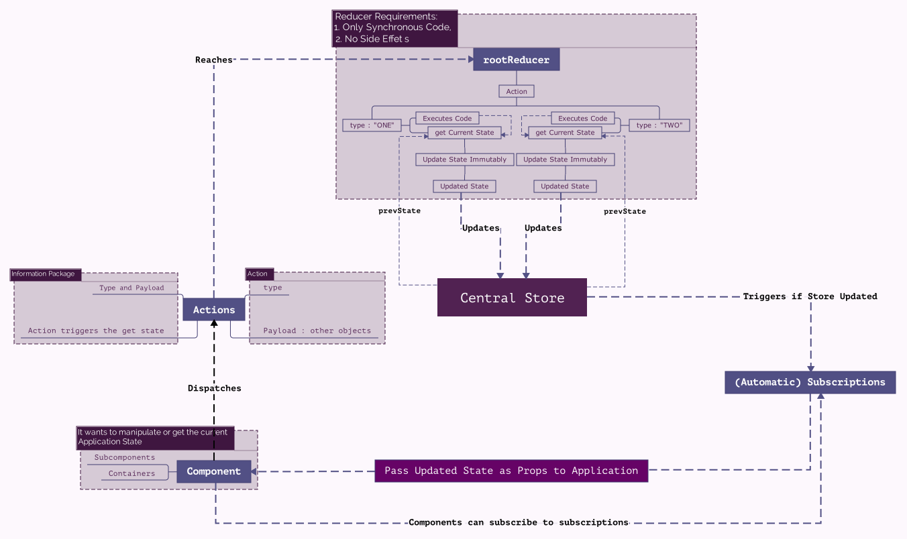
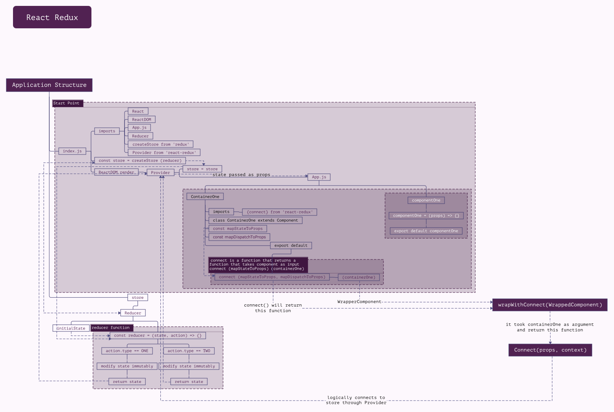

# REDUX - Undestanding it




> Redux is a standalone package and it can work without React. To use redux, we need Redux

```javascript
const redux = require ('redux');
const createStore = redux.createStore;
```
Below are the details of different components of Redux.

### Reducers
1. It is the only thing that is strongly connected to the store. It holds the logic when to update the state.
2. Action is the javascript object that has the type and other payload objects
3. The logic is binded to action.type. Example below.
```javascript
const initialState = {
    counter: 0
}
const rootReducer = (state = initialState, action) => {
    switch (action.type){
        case 'INC_COUNTER':
            console.log(`In ${action.type} type`);
            return {
                ...state,
                counter : state.counter + 1
            }
            break;
        case 'ADD_COUNTER':
            console.log(`In ${action.type} type`);
            return {
                ...state,
                counter : state.counter + action.value
            }
            break;
        default: 
            return state;
    }
    return state;
}
```

### Store
1. it will take reducer as the parameter.
2. Since it takes reducer as a parameter, the reducer needs to be created and available before creating the store.
```javascript
const store = createStore(rootReducer);
```

### Subscriptions
1. It elminates the need to asking getState to understand the state change
2. It will inform me whenever the state changes if subscribe to it.
3. Subscribe take function as argument
4. Subscrition is setup right after the store is created so that we will get the details from initial state.
```javascript
store.subscribe( () => {
    console.log(`You are subscribed and here is your detail`)
    console.log(store.getState());
})
```

### Dispactch 
1. Dispatch Action - Code Dispatching an action
2. Action is an javascript object
3. 'type' property is must and important. The value is an unique identifier and the convention is to use all UPPER CASE
```javascript
store.dispatch({type: 'INC_COUNTER'});
store.dispatch({type: 'ADD_COUNTER', value: 5});
```


# Application conventions

---
#### Connecting the Redux to React
1. Install redux from npm as dependency
    > npm install --save redux

2. Most of the application will have their store created on the index.js file which will mount the root container App.js
```javascript
/store/reducer.js
const initState = {
    counter: 0
}
const reducer = ( state = initState, action ) => {
    return state;
}
export default reducer;

./index.js
import { createStore } from 'redux';
import reducer from './store/reducer';
const store = createStore(reducer);
```

3. As mentioned above most scenarios, we will need a seperate place to store the reducers. It is not mandatory but conventionaly way for easy use.
---
#### Connecting the store to the React application
4. We need to install react-redux as the depency to connect store to react
    > npm install --save react-redux

4. Import the Provider from react-redux and wrap it to the root component
```javascript
import { Provider } from 'react-redux';
ReactDOM.render(<Provider><App/></Provider>, document.getElementById('App'));
```

5. Provider is the helper component which allows us to inject the store into the React Component. For hooking up the provider component with the store, need to setup the property that passes the created store.
    > the property name is store and we should pass the store to it
```javascript
ReactDOM.render(<Provider store={store}><App/></Provider>, document.getElementById('App'));
```

6. To get the state from the central store to the container or the component, we need to set the subscriptions in the respective component. We can use the feature provided by the react-redux package.
    > Still the containers/components will pass the state to its child components. The only thing that changes - components/containers will not maintain the state but the central store does.

7. We need to import 'connect' which is a function which will return the function as a higher order component which takes then the component as its input
```javascript
'./containers/Counter/Counter.js'
import { connect } from 'react-redux';
class Counter extends Component {
    ...
}
export default connect()(Counter);
```

8. We pass two piece of information to the connect function
    - which slice of the state that you want it in return in this container(since the central store maintain number of state that belongs to various components/containers)
        - We will get the slice of the ***state from the central store as a props but not as a state*** to our container because state is the thing which can be changed only internally but props doesn't change internally rather it is passed by the parent container. Since the idea is to manage the state to seperate component, we are receiving those state only as props from central store.
    - which action that I want to dispatch (since a bigger application will have lot of actions that manupulate the state)
    
    > Need to define the slice of the state that needed after the class definition
```javascript
'./containers/Counter/Counter.js'
import { connect } from 'react-redux';
class Counter extends Component {
    render () {
        //The counter component will receive the state from centra store via connect as props hence accessing like this.
        return <CounterOutput value={this.props.ctr} 
    }
}
//const name can be anything
const mapStateToProps = state => {
    return {
        //it returns the jsx object, we will map the counter property of the state to counter locally here 
        ctr: state.counter
    }; 
}
//connect will return a function will take Counter component as its input and thus giving access Counter to mapStateToProps.
export default connect(mapStateToProps)(Counter);
```

#### Dispatching actions from within the component
9. We can pass the second configuration mapDispatchToProps and pass it to connect function
```javascript
class Counter extends Component {
    render () {
        //The counter component will receive the dispatch function through props hence accessing like this. The dispatch function will be same as we defined below. This has the two-way binding dispatch function which then be executed at reducers via action parameter by handling it through event here.
        return <CounterControl label="Increment" clicked={this.props.incCounterHandler} />
    }
}
//mapDispatchToProps is a constant that return the Object which will have a key mapped to dispatch function
const mapDispatchToProps = dispatch => {
    return {
        incCounterHandler: () => dispatch(type: 'INCREMENT')
    }
}
//By passing these two arguments, we are requesting both the slice of the state and dispatching action.
export default connect(mapStateToProps, mapDispatchToProps)(Counter);
//If we just need to dispatach action but don't need a slice then, we can pass null as the slice needed
export default connect(null, mapDispatchToProps)(Counter);
```
---
#### Outsourcing the action types.
10. It is best practise to outsource the action types to a separate file and importing them into reducers and the component which will dispatch actions. This will eliminate the TYPO that likely to occur and highlight it to us on the development mode itself
```javascript
'./store/actions.js'
export const INCREMENT = 'INCREMENT;

'./store.reducer.js'
//import all the exported const from actions.js as actionTypes object.
import * as actionTypes from './actions';
const reducer = ( state, action) => {
    switch(action.type){
        case actionTypes.INCREMENT:
        DO SOMETHING
        return state
    }
}
export default reducer

'./containers/Counter/Counter.js'
//import all the exported const from actions.js as actionTypes object.
import * as actionTypes from './actions';
const mapDispatchToProps = dispatch => {
    return {
        incCounterHandler: () => dispatch({type: actionTypes.INCREMENT})
    }
}
export default connect(null, mapDispatchToProps)(Counter)
